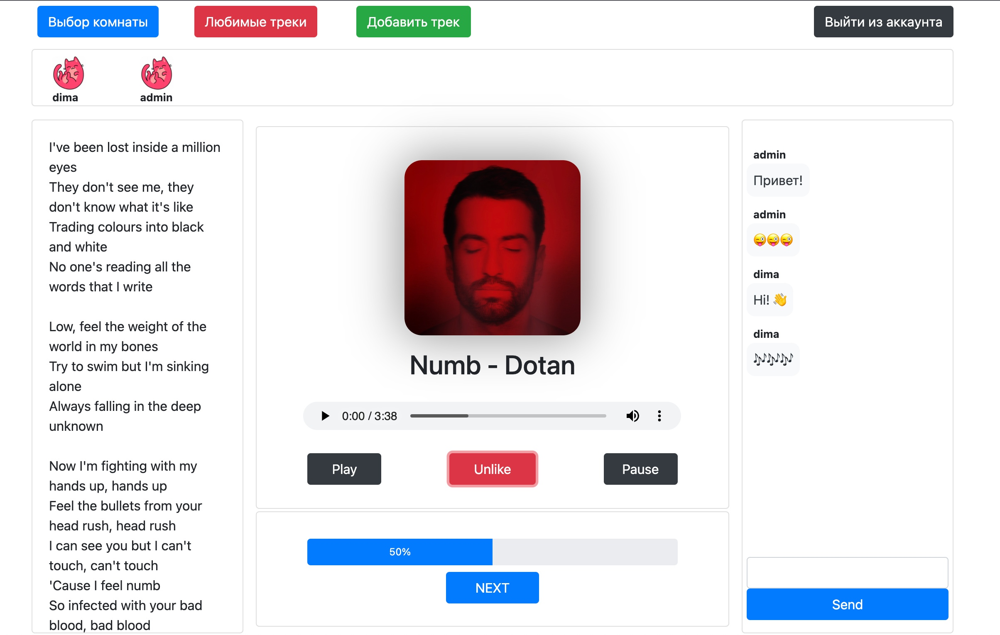
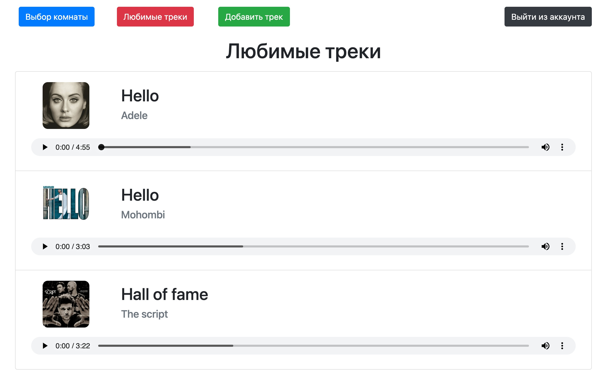
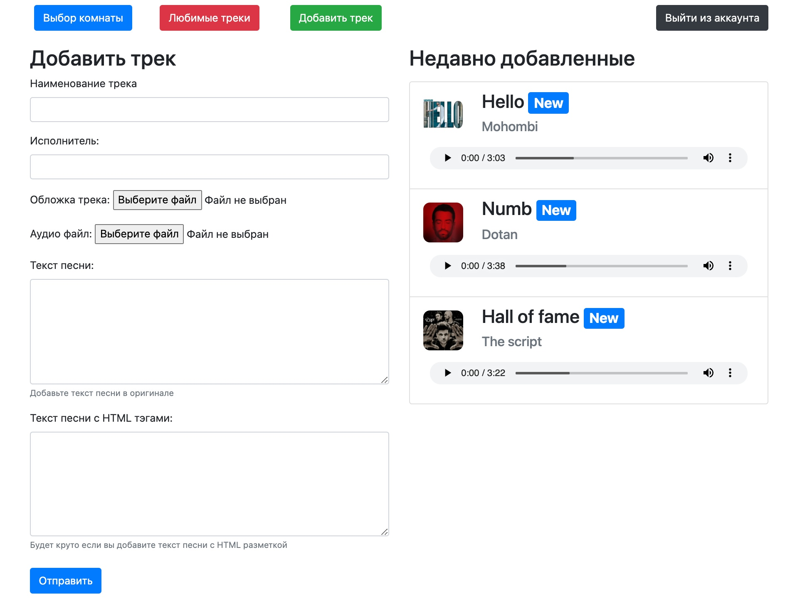

## Курсовая работа по курсу ТРПС   Веб-приложение совместного прослушивания аудио-треков «Музыкальная🎵 комната»

### Описание
Веб-приложение, которое можно использовать для совместного прослушивание аудио-треков внутри комнаты, 
общаться в чате с участниками одной комнаты и совместно управлять воспроизведение трека.

### Стек
- Django🐍
- PostgreSQL🗂️
- Redis🚀

### Внешний вид
#### Вид страницы музыкальной комнаты

#### Вид страницы любимых аудитреков

#### Вид страницы добавление аудитреков

